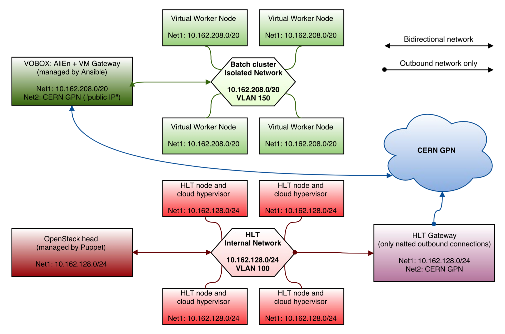

ALICE HLT Cloud management
==========================

This repository contains instructions and utilities to control the Cloud running
on top of the [ALICE](http://alice.cern.ch/) HLT Cluster.

## Adding and removing nodes to the Cloud

The HLT Cloud is meant for opportunistic computing. HLT operators might, at any
time, add and remove nodes to the Cloud.

Such operations are facilitated by the control script `openstack-hlt-manage`.

To use the script, one must log in to the OpenStack head node, and enter the
administrative environment first:

```bash
openstack-enter admin
```

> The administrative environment contains environment variables needed to run
> the OpenStack commands. An `[OpenStack]` banner is prepended to the prompt,
> and the current user and tenant are displayed. This is a normal shell: you can
> exit it by typing `exit`.

Syntax:

```
openstack-hlt-manage [--for-real] [--no-colors] [--line-output] [--parallel] [--vm-timeout <seconds>] [--force-shutoff] [--ssh-config <file>] [--nvms] [enable|disable|status|runvms|listwns|vmstats] [[node1 [node2...]]|@list.txt]
```

Instead of specifying a list of nodes one can just pass a list file with the
`@list.txt` option: in this case the content of `list.txt` will be considered,
one host per line. Lines beginning with `#` will be ignored and considered
comments. Empty lines are skipped.

**Note:** if using the `--parallel` option, nodes list can also be specified in
the format supported by the `-w` option of `pdsh` (see
the [manpage](http://linux.die.net/man/1/pdsh)).

### Querying the status

```
openstack-hlt-manage [--nvms] status
```

The optional `--nvms` parameter also queries the number of VMs present on each
hypervisor. It is disabled by default as it slows down a bit the operations.

Sample output:

```
+----------------------+-----------+--------+------+-----------------------------------------------------+
| Hypervisor           | Runs VMs? | Alive? | #VMs | VMs                                                 |
+----------------------+-----------+--------+------+-----------------------------------------------------+
| cn43.internal        |    yes    | alive  |    2 | 10.162.208.10 10.162.208.57                         |
| cn44.internal        |    yes    | alive  |    0 |                                                     |
| cn45.internal        |    yes    | alive  |    0 |                                                     |
| cn46.internal        |    yes    | alive  |    0 |                                                     |
| cn47.internal        |    yes    | alive  |    2 | 10.162.208.4 10.162.208.48                          |
+----------------------+-----------+--------+------+-----------------------------------------------------+
```

For each hypervisor you will see:

* if it is **enabled** to run virtual machines,
* if the OpenStack daemons running on it are **responding**, and
* *(optionally)* the **number** of deployed virtual machines

A *disabled* hypervisor should report:

* **Runs VMs? no**, meaning that OpenStack will not try to schedule VMs on it
* **Alive? dead**, meaning that no OpenStack daemon is running on it


### Adding a node to the Cloud

Adding a node to the HLT Cloud means allowing it to run virtual machines.
Virtual machines are then usually deployed automatically using
[elastiq](https://github.com/dberzano/elastiq).

Syntax:

```
openstack-hlt-manage [--for-real] [--parallel] enable [node1 [node2 [node3...]]]
```

Each node in the list is enabled to run virtual machines. This means that:

* OpenStack services are explicitly started on each node in the list, and
* the OpenStack central service is told to use those nodes.

Node names must be specified in the full form, *i.e.* with the domain name
appended. It is the same domain name displayed by the
[status command](#querying-the-status).

Errors enabling a single node are non-fatal: the program will continue with the
other nodes, and report errors accordingly.

It is convenient to pass `--parallel` to enable hosts in parallel: this is way
faster when running on many hosts at the same time.

**Note:** the command runs in **dry-run** mode by default, meaning that it only
simulates what would do. Prepend `--for-real` to effectively execute it.

Sample output:

```console
$> openstack-hlt-manage --for-real enable cn43.internal cn44.internal
[ OK ] Enabling hypervisor cn43.internal
[ OK ] Starting OpenStack daemons on cn43.internal
[ OK ] Enabling hypervisor cn44.internal
[ OK ] Starting OpenStack daemons on cn44.internal

All commands executed successfully.
```

### Removing a node from the Cloud

Removing a node from the HLT Cloud means:

* disabling the node from the central OpenStack manager,
* deleting (abruptly) virtual machines currently running on the same nodes,
* shutting down all OpenStack services on the node.

This means that when a node is disabled, no OpenStack service runs on it.

Those two operations normally involve a series of OpenStack commands, but they
are simplified by the control script:

```
openstack-hlt-manage [--for-real] [--force-shutoff] [--vm-timeout <seconds>] disable [node1 [node2 [node3...]]]
```

As for the `enable` command, errors removing one node are non-fatal and the
program will continue to disable the other nodes.

It is convenient to pass `--parallel` to disable hosts in parallel: this is way
faster when running on many hosts at the same time, expecially if you consider
that the command waits for virtual machines to disappear after issuing the kill
command.

The `--vm-timeout` switch (optional; defaults to 300 s) tells the script how
long it is acceptable to wait for OpenStack to delete VMs before force-killing
them. Use it to fine-tune the wait time. In combination with `--force-shutoff`
OpenStack services on the compute node will be deactivated even when the timeout
is reached.

**Note:** the command runs in **dry-run** mode by default, meaning that it only
simulates what would do. Prepend `--for-real` to effectively execute it.

Sample output:

```console
$> openstack-hlt-manage --no-colors disable cn47.internal
[ OK ] Disabling hypervisor cn47.internal
[ OK ] Starting OpenStack daemons on cn47.internal
[ OK ] Deleting VM d9d0c131-fd60-4ecb-97cf-c0e46901edf1 on hypervisor cn47.internal
[ OK ] Deleting VM 380a44d5-71cd-4254-a3ae-4f9e716ec523 on hypervisor cn47.internal
Waiting max 3600 s for VMs to be deleted on cn47.internal...2 running (3600 s left)...all gone in 1s!
[ OK ] Shutting down OpenStack daemons on cn47.internal

All commands executed successfully.
```

From the output, you can see that OpenStack daemons are *started* before
deleting virtual machines, and subsequently *stopped*. This is counterintuitive:
we must make sure services are running before issuing delete commands, otherwise
deletion will fail. In any case, since we have *disabled* the host in the first
place, no VM will be scheduled there even if we temporarily start the daemons.

Please note that OpenStack takes care of some cleanup (disk- and network-wise)
after issuing the delete command: this takes some time (usually less than one
minute), therefore issuing:

```bash
openstack-hlt-manage --nvms status
```

right after running `disable` may show a number of virtual machines greater than
zero for the disabled hosts for a short while. If you reissue the command after
some time, the number will correctly display zero.

### Common parameters

Switches must come before any command. The following switches can be used with
any command.

* `--no-colors`: suppresses any color from the output. Useful if running inside
  a `watch` or from a terminal that does not support special escape sequences.
* `--line-output`: all messages are line-buffered, *i.e.* they end with a new
  line. This is used automatically by the `--parallel` option for its subworkers
  to avoid mangled output.
* `--parallel`: use `pdsh` (with the *exec* RCMD module) under the hood to
  execute enable and disable operations for the given hosts in parallel. This
  mechanism makes enabling and disabling many nodes at the same time very fast.
* `--ssh-config <file>`: for enabling and disabling OpenStack daemons, ssh is
  executed towards target nodes. In order to configure SSH connection options
  (for instance, the private key to use) a SSH configuration file must be
  provided. Omit this option on the production nodes: the correct configuration
  will be picked automatically. If you specify a configuration file manually you
  must use an absolute path.

## Precaching images on hypervisors

Use the OpenStack cache prefiller:

```bash
openstack-prefill-cache [image-name] [host-range-pdsh-format]
```

**Note:** you need to be in the administrative OpenStack environment for using
it. As root, on the OpenStack head:

```bash
openstack-enter admin
```

The **image name** is the readable name of the image you want to cache
(something like `CentOS6-build12`). Check available images with:

```bash
glance image-list
```

The list of hosts has the same format as pdsh. An argument like:

```
cn[43-45,47]
```

will expand to **cn43**, **cn44**, **cn45** and **cn47**. Please note that you
need to put it in quotes in order to prevent the shell from expanding it:

```bash
openstack-prefill-cache CentOS6-build12 'cn[43-45,47]'
```

It is sometimes more convenient to use a text file containing a list of hosts,
in the same format supported by `openstack-hlt-manage` (empty lines ignored,
lines can be commented with `#`):

```bash
openstack-prefill-cache CentOS6-build12 @list.txt
```

Sample output:

```
Getting image CentOS6-build12 (id=58853970-f8ac-41d0-9255-8a6d3e3b85dc)
Chain transferring on every node
transferring /var/lib/nova/instances/hlt-glance-cache-58853970-f8ac-41d0-9255-8a6d3e3b85dc to 5 host(s)...
[ ok ] openstack.internal --> cn44
[ ok ] openstack.internal --> cn46
[ ok ] cn44 --> cn45
[ ok ] openstack.internal --> cn43
[ ok ] cn46 --> cn47
file size: 1145MB
elapsed time: 1.01s
Converting image in parallel on all hosts
cn43: Started image conversion
cn47: Started image conversion
cn44: Started image conversion
cn46: Started image conversion
cn44: Image conversion done
cn43: Image conversion done
cn47: Image conversion done
cn46: Image conversion done
cn45: Started image conversion
cn45: Image conversion done
Done!
```

### How it works

This utility uses `rsync-wave.py` behind the scenes to transfer the image via
SSH (rsync): the image is first transferred to an host, and when the transfer
completes, this host becomes source for another transfer - and so on, until it
has been copied to every host.

This mechanism prevents overloading the head node for the initial transfer.

When the base image has been transferred on all nodes, it is converted to "raw"
format into the directory that OpenStack uses as "cache directory". This
operation is performed in parallel with pdsh.

### OpenStack conventions

By default, an image with, *e.g*, ID `58853970-f8ac-41d0-9255-8a6d3e3b85dc`
will be found on the head node at the following location:

```
/var/lib/glance/images/58853970-f8ac-41d0-9255-8a6d3e3b85dc
```

Hypervisors ("compute nodes") will have it cached (in raw format) at:

```
/var/lib/nova/instances/_base/ba803eec7b06980196d8dd62262f999a5f9c8bbb
```

This hexadecimal string is the **SHA1 sum of the original Glance ID**. Check
with:

```console
$> echo -n 58853970-f8ac-41d0-9255-8a6d3e3b85dc | sha1sum | awk '{print $1}'
ba803eec7b06980196d8dd62262f999a5f9c8bbb
```

Please note that images in `_base` directory are purged by default by OpenStack
if no more instances are using them. To prevent this from happening, change the
`nova.conf` configuration on the compute node as follows:

```ini
[DEFAULT]
remove_unused_base_images = False
```

## OpenStack operations

All OpenStack operations are performed from the head node within the proper
environment loaded with:

```
openstack-enter admin
```

or the appropriate user.

### Register a new VM image

Register a new image from URL like this:

```bash
glance image-create --name "CentOS6-build12" \
                    --disk-format qcow2 \
                    --container-format bare \
                    --is-public=True \
                    --copy-from http://personalpages.to.infn.it/~berzano/cloud-images/CentOS6-x86_64-build12-compat0.10.qcow2
```

Check the status using:

```bash
glance image-list
```

When the status is **active** (instead of **saving**) transfer it to all nodes:

```
openstack-prefill-cache CentOS6-build12 @list_of_nodes.txt
```

### Start new VMs

After enabling the relevant hosts with:

```bash
openstack-hlt-manage --for-real --parallel enable @list.txt
```

you can simply enable VMs like this:

```bash
openstack-hlt-manage --for-real runvms
```

VMs will be started in a way that the cluster is filled. VMs in excess go to
**ERROR** state, but the head node is configured to clean them up after a while.

### Manually starting new VMs

If for some reason the automatic procedure does not work, or if you want to
customize the way VMs are run, follow this section.

You can list the available keys and profiles with:

```bash
nova keypair-list
nova flavor-list
```

Then start a number of VMs like this:

```bash
nova boot --flavor ali1.xlarge --image CentOS6-build13 --key-name WorkerNodesSsh --user-data /var/lib/elastiq/wn-user-data.txt --num-instances 200 wn-grid
```

After a while you can delete the VMs in excess like this (they probably went to
**ERROR** state):

```bash
nova list | grep ERROR | awk '{print $2}' | xargs -L1 nova delete
```

## HLT network schema


